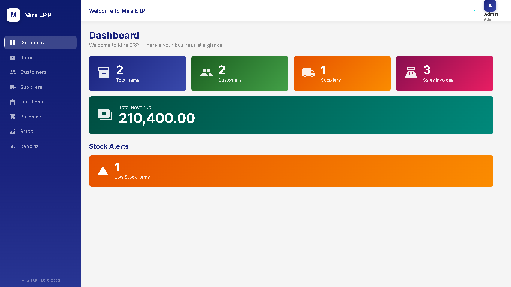
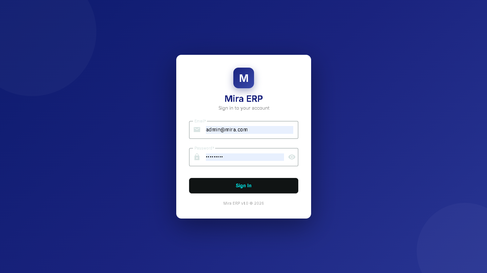
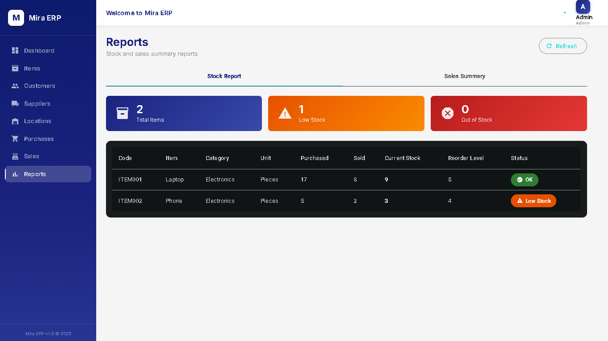
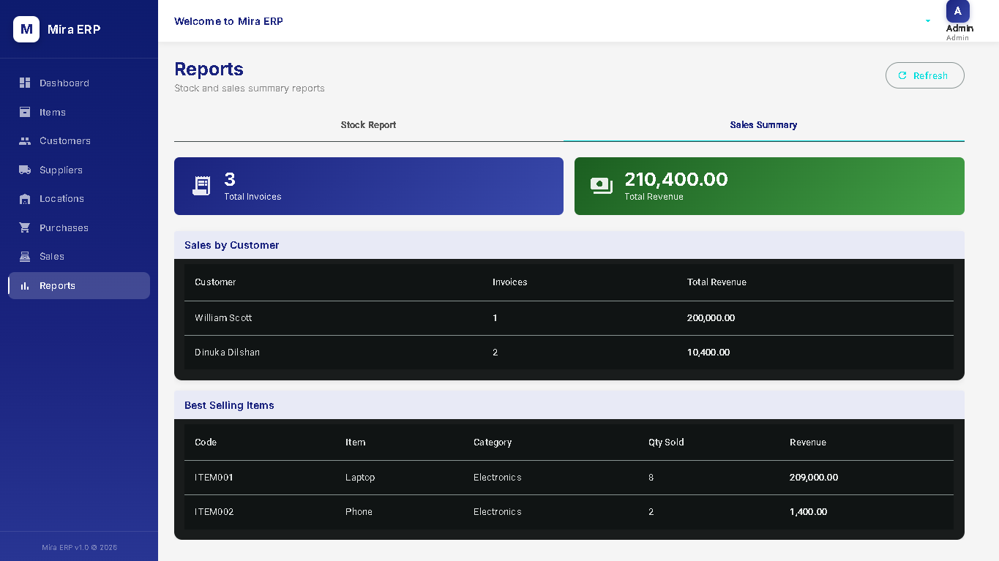
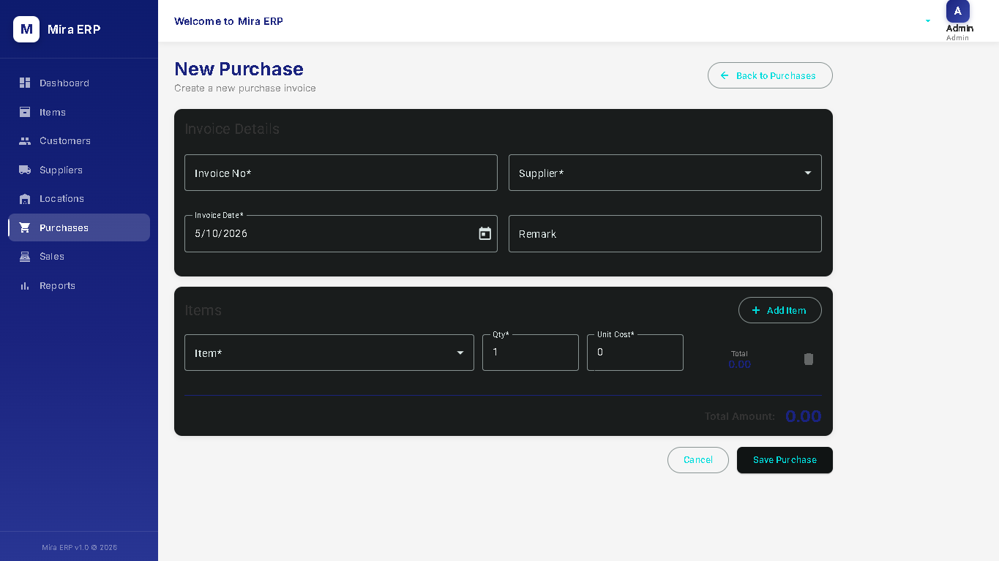
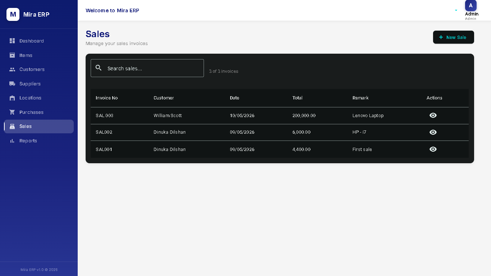

  # Mira ERP 🚀

A full-stack ERP (Enterprise Resource Planning) system built as a MVP project.



## 👨‍💻 Developer

**Dinuka** — Full Stack Developer  
GitHub: [@DinukaD97](https://github.com/DinukaD97)

---

## 🌐 Live Demo

- **App:** https://storied-chimera-52065e.netlify.app
- **API:** https://mira-erp-production.up.railway.app

**Demo credentials:**
- Email: `admin@mira.com`
- Password: `Admin@123`

## 🛠️ Tech Stack

### Backend
- **.NET 8 Web API** — RESTful API
- **Entity Framework Core** — ORM
- **SQL Server LocalDB** — Database
- **JWT Bearer Tokens** — Authentication

### Frontend
- **Angular 19** — Frontend framework
- **Angular Material** — UI component library
- **TypeScript** — Language
- **SCSS** — Styling

---

## ✨ Features

### 🔐 Authentication
- JWT based login system
- Route guards for protected pages
- Auto redirect on session expiry

### 📦 Inventory Management
- Items CRUD with categories and units
- Real time stock tracking
- Low stock and out of stock alerts
- Stock increases on purchase
- Stock decreases on sale

### 👥 Master Data
- Customer management
- Supplier management
- Location management
- Category and Unit management

### 🛒 Purchase Module
- Purchase invoice creation
- Multi item line entries
- Automatic stock update on save
- Stock transaction history
- Database transaction safety

### 💰 Sales Module
- Sales invoice creation
- Multi item line entries
- Stock availability check before sale
- Automatic stock decrease on save
- Invoice detail view

### 📊 Reports
- **Stock Report** — Current inventory with status indicators (OK / Low Stock / Out of Stock)
- **Sales Summary** — Total revenue, sales by customer, best selling items
- **Dashboard** — Real time business overview with stock alerts

### 🔍 Search
- Live search on Items, Customers and Sales
- Search by multiple fields
- Result counter

### 🛡️ Error Handling
- Global HTTP error interceptor
- Snackbar notifications (success, warning, error)
- Form validation with user friendly messages
- Stock check with clear error messages

---

## 📁 Project Structure
mira-erp/
├── mira-api/                    # .NET 8 Backend
│   └── Mira/
│       └── Mira.API/
│           ├── Controllers/     # API Controllers
│           ├── Services/        # Business Logic
│           ├── Models/
│           │   ├── Entities/    # Database Entities
│           │   └── DTOs/        # Data Transfer Objects
│           ├── Data/            # DbContext & Seeder
│           └── Helpers/         # JWT Helper
│
└── mira-client/                 # Angular 19 Frontend
└── mira-client/
└── src/app/
├── core/
│   ├── models/      # TypeScript Models
│   ├── services/    # Angular Services
│   ├── guards/      # Route Guards
│   └── interceptors/# HTTP Interceptors
├── features/        # Feature Modules
│   ├── auth/
│   ├── dashboard/
│   ├── items/
│   ├── customers/
│   ├── suppliers/
│   ├── locations/
│   ├── purchases/
│   ├── sales/
│   └── reports/
└── shared/          # Shared Components
└── components/
├── layout/
├── sidebar/
└── header/


---

## 🚀 Getting Started

### Prerequisites
- [.NET 8 SDK](https://dotnet.microsoft.com/download/dotnet/8.0)
- [Node.js 18+](https://nodejs.org/)
- [Angular CLI 19](https://angular.io/cli)
- [SQL Server LocalDB](https://docs.microsoft.com/en-us/sql/database-engine/configure-windows/sql-server-express-localdb)

### Backend Setup

```bash
# Navigate to API project
cd mira-api/Mira/Mira.API

# Restore packages
dotnet restore

# Apply database migrations
dotnet ef database update

# Run the API
dotnet run
```

API runs on: `https://localhost:7225`

Default admin credentials:
- Email: `admin@mira.com`
- Password: `Admin@123`

### Frontend Setup

```bash
# Navigate to Angular project
cd mira-client/mira-client

# Install packages
npm install

# Run the app
ng serve
```

App runs on: `http://localhost:4200`

---

## 📸 Screenshots

### Login Page


### Dashboard


### Stock Report


### Sales Summary


### Purchase Entry


### Sales Entry


---

## 🗄️ Database Schema

### Core Entities
- **Users** — System users with JWT auth
- **Items** — Products with stock tracking
- **Categories** — Item categories
- **Units** — Units of measurement
- **Customers** — Customer master data
- **Suppliers** — Supplier master data
- **Locations** — Warehouse locations

### Transaction Entities
- **PurchaseInvoices** — Purchase headers
- **PurchaseInvoiceItems** — Purchase line items
- **SalesInvoices** — Sales headers
- **SalesInvoiceItems** — Sales line items
- **StockTransactions** — Full stock audit trail

---

## 🔑 API Endpoints

### Auth
| Method | Endpoint | Description |
|--------|----------|-------------|
| POST | `/api/auth/login` | Login and get JWT token |

### Items
| Method | Endpoint | Description |
|--------|----------|-------------|
| GET | `/api/item` | Get all items |
| GET | `/api/item/{id}` | Get item by ID |
| POST | `/api/item` | Create item |
| PUT | `/api/item/{id}` | Update item |
| DELETE | `/api/item/{id}` | Delete item |

### Purchases
| Method | Endpoint | Description |
|--------|----------|-------------|
| GET | `/api/purchase` | Get all purchases |
| GET | `/api/purchase/{id}` | Get purchase by ID |
| POST | `/api/purchase` | Create purchase + update stock |

### Sales
| Method | Endpoint | Description |
|--------|----------|-------------|
| GET | `/api/sales` | Get all sales |
| GET | `/api/sales/{id}` | Get sale by ID |
| POST | `/api/sales` | Create sale + decrease stock |

### Reports
| Method | Endpoint | Description |
|--------|----------|-------------|
| GET | `/api/report/stock` | Stock report |
| GET | `/api/report/sales-summary` | Sales summary |
| GET | `/api/report/dashboard` | Dashboard summary |

---

## 🏗️ Architecture Patterns

- **Repository Pattern** — Services abstract data access
- **DTO Pattern** — Clean separation between entities and API responses
- **Interceptor Pattern** — Global error handling
- **Guard Pattern** — Route protection
- **Transaction Pattern** — Database transactions for stock updates

---

## 📋 Development Timeline

| Day | Task |
|-----|------|
| Day 1 | Project setup, GitHub, DB, User entity |
| Day 2 | All 12 entities created and migrated |
| Day 3 | JWT authentication |
| Day 4 | Angular setup, login end to end |
| Day 5 | Layout, sidebar, dashboard |
| Day 6 | Category, Unit, Item CRUD |
| Day 7 | Customer, Supplier, Location CRUD |
| Day 8 | Purchase module with stock tracking |
| Day 9 | Sales module with stock decrease |
| Day 10 | Stock report |
| Day 11 | Sales summary report |
| Day 12 | Dashboard with real data |
| Day 13 | Search and filters |
| Day 14 | Validation and error handling |
| Day 15 | UI polish |
| Day 16 | README and portfolio preparation |

---

## 📄 License

This project is open source and available under the [MIT License](LICENSE).

---

*Built with ❤️ by Dinuka*